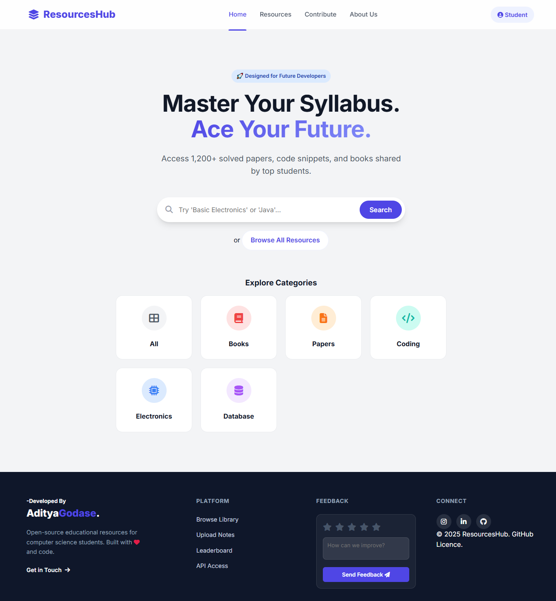
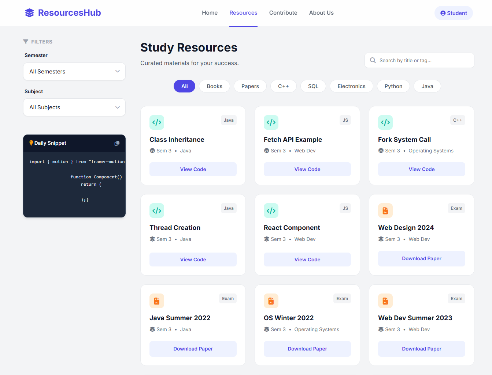

## ResourcesHub

Master Your Syllabus. Ace Your Future.
    An open-source educational platform connecting students with 1,200+ solved papers, books, and code snippets.
  

## 🖼️ Preview

<div align="center"> 
  
  
</div>

## 🚀 Features

ResourcesHub is designed with a focus on **User Experience (UX)** and **Performance**.

* **🔍 Smart Search:** Real-time filtering by title, tags, or subject matter.
* **📱 Fully Responsive:** Optimized for Mobile, Tablet, and Desktop with a custom slide-out navigation drawer.
* **📂 Resource Categorization:** Filter via Semester (1-3) or Subject (DBMS, Java, C++, etc.).
* **💻 Code Snippet Viewer:** Built-in syntax highlighting for viewing code directly in the browser.
* **🎨 Modern UI:** Glassmorphism design system with interactive hover states and accessible contrast ratios.
* **📥 Direct Downloads:** One-click downloads for PDF Books and Question Papers.

## 🛠 Tech Stack

This project uses a modern, lightweight frontend stack with no build steps required.

| Tech | Description |
| --- | --- |
| **HTML5** | Semantic markup for accessibility and structure. |
| **CSS3** | Custom variables (`:root`), Grid/Flexbox layouts, and Glassmorphism effects. |
| **JavaScript** | Vanilla ES6+ for DOM manipulation, API fetching, and State management. |
| **DatabaseServer** | SQL Database to fetch the data. |
| **Python** | Act as Middleman Between Frontend and Database For Security. |
| **FontAwesome** | Iconography for UI elements. |
| **Inter Font** | Clean, highly readable typography from Google Fonts. |

## 📂 Project Structure

```bash
ResourcesHub/
├── index.html          # Landing page with hero section and categories
├── resources.html      # Main library with sidebar filters and grid
├── contribute.html     # Upload form for new resources
├── style.css           # Global styles, variables, and responsive media queries
├── script.js           # Core logic: API fetch, filtering, UI toggles
└── README.md           # Project documentation

## 🤝 Contributing ##

Contributions are always welcome!

1.Fork the Project

2.Create your Feature Branch

3.Commit your Changes

4.Push to the Branch

5.Open a Pull Request

Built with ❤️ by the Open Source Community